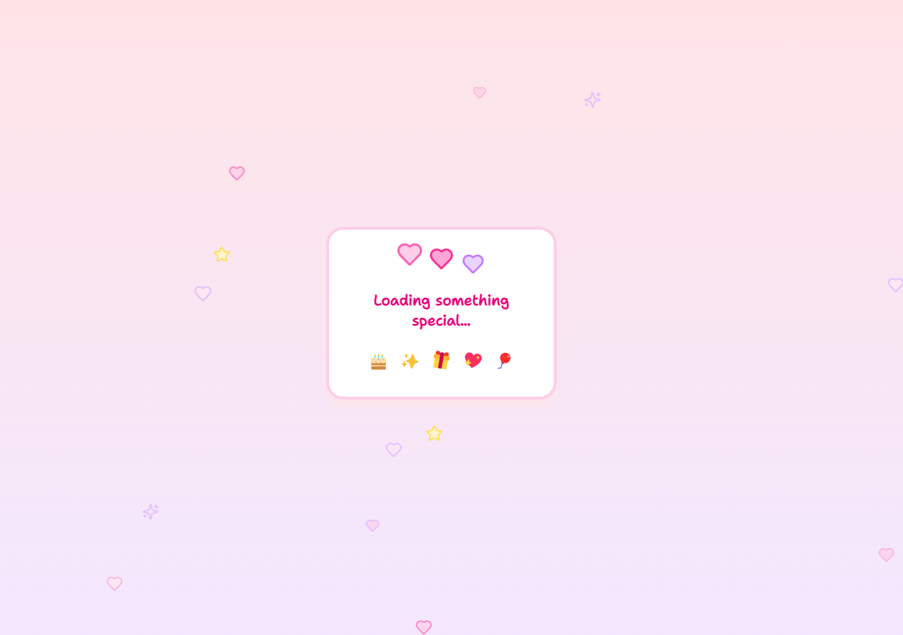
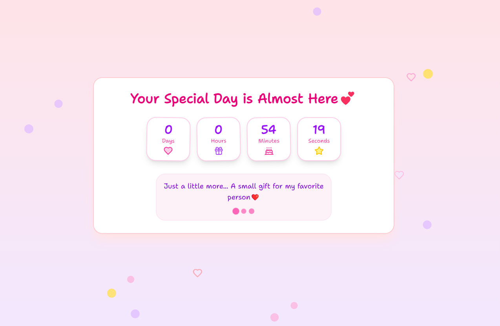
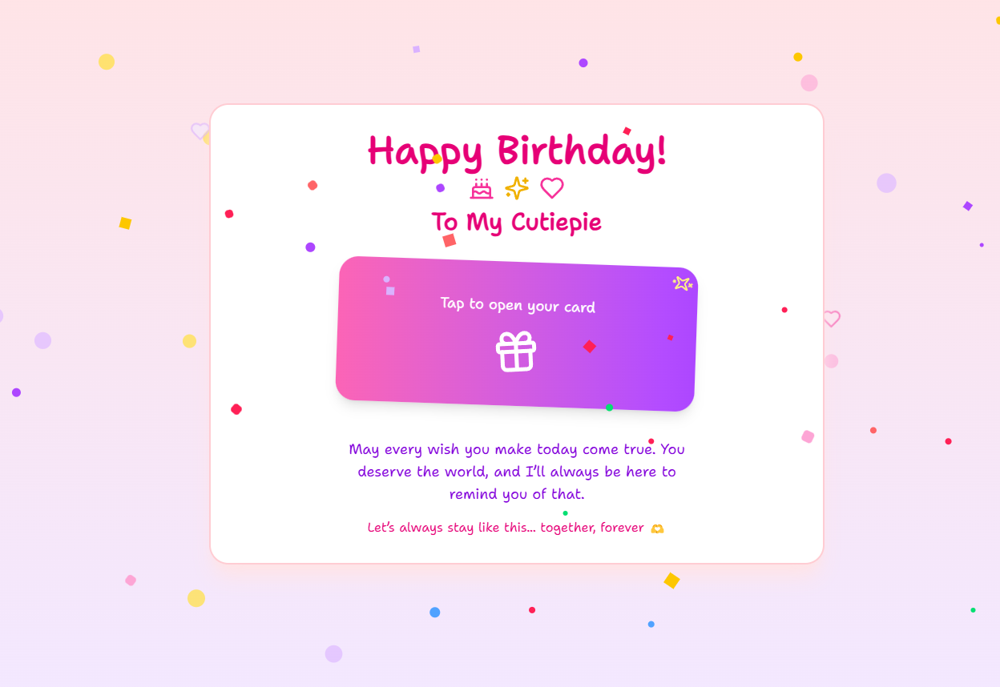

# Birthday Surprise Website 🎂🎉

This is a special **Birthday Celebration Website** created using **Next.js, Tailwind CSS, Framer Motion**, and **Lucide Icons**.  
It's designed as a personal and emotional way to wish someone special — when you can't be there physically, let your code speak! 💖

---

## 🧠 Project Idea

> **POV:** It's her birthday, but you can't meet — so you build something special instead.

The website features:

- A live countdown timer ⏳
- Personalized birthday messages 🎈
- Smooth animations using Framer Motion ✨
- Cute icons and a heartfelt design 💌

This was created as part of an emotional reel where the journey begins with a few lines of code in VS Code and ends with a beautiful surprise on the browser.

---

## Screenshots:

1. **Loader Page**
   

2. **Countdown Page**
   

3. **Happy Birthday Message Screen**
   

---

## 🛠️ Built With

- [Next.js](https://nextjs.org/)
- [Tailwind CSS](https://tailwindcss.com/)
- [Framer Motion](https://www.framer.com/motion/)
- [Lucide Icons](https://lucide.dev/)

---

## 🔧 Setup

To run this project locally:

```bash
git clone https://github.com/Anuj579/birthday-site.git
cd birthday-site
npm install
npm run dev
```

Make sure to update the target date in `Home` component if you want to reuse this.

---

Thanks for checking out this project! If you liked it, consider giving it a ⭐️ on GitHub and sharing the reel ❤️

---

## ⚠️ License & Usage

### Free Code
- This free version is strictly for **personal use only**.  
- You **cannot** post, upload, or share this project online in any form (e.g., Instagram reels, YouTube videos, websites, or any public platform).  
- Using this free code publicly is **prohibited**.
- Any violation will be considered **copyright infringement**, and I reserve the right to report it.
